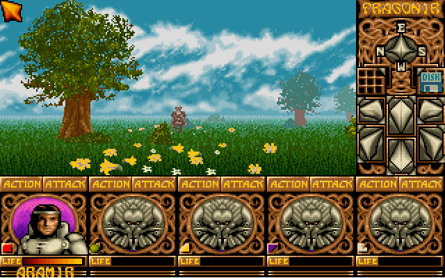
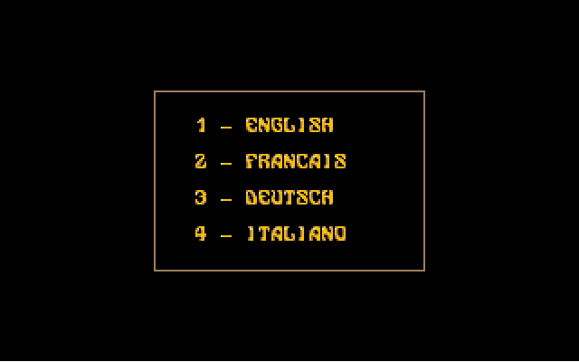
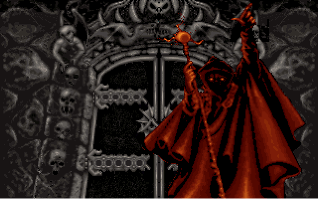
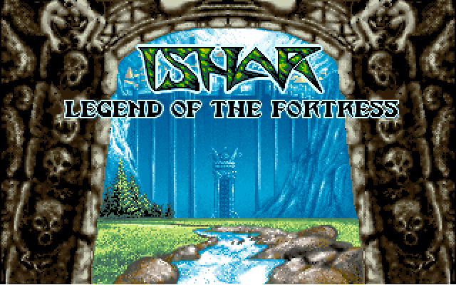

# Ishar 1 — findings

What the game *does*: mechanics, world, content. Byte layouts and file formats live in
`FORMATS.md`; how we plan to get there is in the Vault
(`Projects/Ishar/reverse-engineering-plan/`).

This file is the handover document for the Compose Multiplatform rewrite. Everything
here should be specific enough to implement from, and every claim should say how it was
established. A finding with no evidence line is a guess that will be believed later.

**Conventions**

- Addresses are `segment:offset` as seen at runtime, with the image offset in brackets
  where known: `017D:04BE [+0x04BE]`.
- Every subsection ends with **Evidence:** — how we know. "Read the code at X",
  "watched the write at X", "changed it and the screen did Y".
- Screenshots go in `captures/`, named `<area>-<what>.png`, and are linked from the
  section they illustrate.
- Unknowns are written down as unknowns, in their own **Open** lines. An empty section
  is more useful than a plausible one.

---

## 1. Game logic

### 1.1 Party and characters

Not yet investigated. The party is 5 slots, each with a portrait, ACTION/ATTACK
buttons and a LIFE bar. Starting character in a fresh game is `ARAMIR`.



**Evidence:** screenshot only. See also `captures/game-lake-shore.png`.

**Open:** character record layout, stat list, XP curve, level-up rules, class system.

### 1.1b The character sheet, read from the game's own labels

`messagee.io` decodes to the English UI strings, which name every field the game shows
for a character:

```
LEVEL        EXPERIENCE     VITALITY      PHYSICAL      MENTAL
ATTRIBUTES:  STRENGTH  CONSTITUTION  AGILITY  INTELLIGENCE  WISDOM
SKILLS:      LOCKPICKING  ORIENTATION  FIRST AID  1 HAND WEAPONS
             2 HANDS WEAPONS  THROWING  SHOOTING  LANGUAGES
```

So a character carries five headline values, five attributes and eight skills. That is
the shape T19 has to find in memory — and it is a much better anchor than hunting for
an unknown structure, since each of these is displayed and therefore stored.

Party actions, from the same file: `GIVE ITEM`, `GIVE MONEY`, `KILL`, `DISMISS`,
`RECRUIT`, `PICK LOCK`, `ORIENTATION`, `FIRST AID`, `MAP`, `CAST SPELL`.

**Evidence:** `tools/io.py` decode of `messagee.io`, whose decoder is verified
byte-for-byte against the emulator on two other files.

### 1.1c Recruitment is a party vote

`TEAM VOTE :` followed by `: OK`, `: NEUTRAL`, `: AGAINST`, and the outcomes
`MEMBER RECRUITED`, `CHARACTER REJECTED`, `COMPLETE PARTY`, `EXPULSION APPROVED`,
`EXPULSION REJECTED`. So existing members vote on whether a candidate joins or is
expelled, and the vote can fail. A rewrite that models recruitment as a simple "add to
party" would miss a real mechanic.

**Evidence:** decoded `messagee.io`.

### 1.2 Combat

Not yet investigated.

**Open:** to-hit and damage formulas, weapon/armour contribution, initiative, what
ACTION vs ATTACK actually dispatch to.

### 1.3 Magic

Not yet investigated.

**Open:** spell list, mana cost table, school/class restrictions, effect dispatch.

### 1.4 Movement and world

The outdoor view is a first-person scene with a compass rose and a DISK icon in the
right-hand panel. Movement responds to the arrow keys; the party walks between
distinct outdoor areas (starting field → lake shore in ~450 steps of driving).

**Evidence:** driven with `key.sh`/MCP, screenshots before and after.

**Open:** map representation, area transitions, coordinate system, collision.

---

## 2. Input

### 2.1 The keyboard is the launcher's, not DOS's

`start.exe` hooks INT 9 at `017D:1072`, reads port 0x60 directly, and translates
scancodes through its own table at `017D:04BE`. Table entry *N* corresponds to
scancode *N+1*. It records a key-down flag per scancode at `017D:031A` and the
translated character of the last key at `017D:0318`, then chains to the previous
handler.

The **letter rows are QWERTY but the number row is French**:

```
sc 02..0B  ->  26 82 22 27 28 60 8A 21 87 85   =  & é " ' ( ` è ! ç à
sc 4F..52  ->  31 32 33 30                     =  keypad 1 2 3 0
sc 10..19  ->  71 77 65 72 74 79 75 69 6F 70   =  q w e r t y u i o p
```

That is why the language menu ("1 - ENGLISH") only answered to the numeric keypad:
pressing top-row `1` delivers `&`. There is no shifted table, so the top row can never
produce a digit. `remap-digits.sh` rewrites those ten entries to `31..30` at runtime.

`start.stp` (14 bytes, `RBVVSAP1J0M1KQ`) carries the launcher's settings, and `KQ`
looks like keyboard=QWERTY — so the QWERTY letter rows are probably that setting
applied to a French base table, with the number row left unconverted. That reading is
unconfirmed.

**Evidence:** disassembled the handler under Spice86; dumped the table; patched the ten
bytes and top-row `1` selected English where it previously did nothing.



### 2.2 Mouse

The game uses the mouse for its UI. Spice86's `send_mouse_move` did **not** move the
in-game cursor in testing, so mouse-driven paths cannot currently be automated.

**Open:** how the game reads the mouse (INT 33h vs raw PS/2), and what it takes to
drive it.

---

## 3. Boot and screens

### 3.0 What the game reads at startup

In order, from a paused start (`tools/gdbtrace.py`, 7.7 s of wall clock):

| # | call | detail |
|---|---|---|
| 0-2 | `START.STP` | opened, 14 bytes read to `1554:0386`, closed — the settings string |
| 3-4 | `cd.tst` | created and closed — a writability probe of the drive |
| 5-7 | `blancpc.io` | 2500 bytes read whole to `1123:0000` |
| 8-13 | `MAIN.IO` | 6-byte header, 16-byte block, then 8000-byte chunks to `e000:0000` |
| 14-16 | `findfirst` | `main.io`, `mcave.io`, `main.io` — existence checks |
| 17 | `logo.IO` | opened; the Silmarils logo follows |

The buffer at `1554:0386` after the `START.STP` read holds the settings string followed
by setup-screen text (`VIDEO`, `CGA`, `EGA`, "to select options, ENTER to validate"), so
the launcher carries a setup UI we have not seen on screen.

Each call's caller was read off the interrupt frame (`SS:SP` holds the return
address), which locates the code rather than just the behaviour:

| call | returns to | listing address |
|---|---|---|
| open `START.STP` | `1554:0e9f` | `seg_13d7:0e9f` |
| read settings | `1554:0eb4` | `seg_13d7:0eb4` |
| create `cd.tst` | `017d:21a9` | `seg_0000:21a9` |
| open an asset | `017d:1feb` | `seg_0000:1feb` |
| read an asset | `017d:2136` | `seg_0000:2136` |
| close | `017d:20be` | `seg_0000:20be` |

The same open/read/close addresses serve `blancpc.io`, `MAIN.IO` and `logo.IO`, so
assets come through one path — and the container decoder sits just upstream of
`seg_0000:2136`, which is where T10 should start. All are annotated in `ishar.chani`.

After `logo.IO` closes the program makes **no further file calls for at least 130 s**
while the logo is on screen: the language menu that follows needs a keypress, not more
loading. Whether the menu transition itself reads anything is not yet established —
tracing through it needs input, and sending keys over MCP pauses the emulator often
enough to slow the trace badly.

**Evidence:** live INT 21h trace over the GDB stub with an MCP-armed conditional
breakpoint; buffer contents and interrupt frames read back at each stop; four runs, the
first eight calls identical in all four and the full 18-call sequence identical in the
two that ran undisturbed.


Sequence from launch, driven by keyboard:

1. Language menu (`1`-`4`).
2. Authors/credits screen.
3. Intro sequence — Krogh artwork, then the ISHAR title over the fortress. Escape
   skips forward; the whole intro loops back to the language menu if left alone.
4. Gameplay.

Startup to the language menu is roughly 30-40 s of emulated time under Spice86 with
the default instruction time scale.




**Evidence:** driven over MCP, screenshot at each step.

---

## 3b. Quests and lore

From the decoded text files. These are the game's own words, quoted only as far as
needed to establish the facts.

**The premise.** Krogh murdered Prince Jarel and took his throne in Ishar, "an evil
temple unleashing hordes of monsters". The speaker of the intro is Akeer, one of Jarel's
companions, who fought the earlier Dark Lord Morgoth. Destroying Krogh grants Ishar's
powers and the kingdom.

**Three quests**, given by Azalghorm, "the Spirit, Silmarilian Gods messenger": the
magician's talisman, the exhausted witch, and gaining possession of all of the rune
tablets.

**Named characters and places** appearing in the strings: Akeer, Zach (another of
Jarel's companions, who gives a flask), Deloria, Azalghorm; the country of Angarahn with
a village and the tavern "The Thirsty Barbarian"; a lacustrine city to the north-east
with the taverns "Frogonir's Inn" and one other.

**Copy protection.** `PROTECTION TEST-MANUAL`, `PLEASE USE YOUR MANUAL AND ENTER`,
`WORD  LINE`, `PAGE :` — the game asks for a word from the printed manual. This is a
gate any automated play will hit, and it is not in the roadmap's boot path yet.

**Evidence:** decoded `textine.io` and `messagee.io`.

## 4. Runtime layout

One DOS process, not two. PSP stays `016D` from the launcher through to gameplay while
`CS` moves from `017D` to `0ABE`, so no second program is EXEC'd — the game code is
part of the same image, `0x9410` bytes in. See `FORMATS.md` for the executable itself.

- `017D:` launcher / front-end. Resident for the session. Owns INT 9.
- `0ABE:` main game. Owns INT 8.
- `DS` in-game observed at `99FE` — a large data/heap area well above the code.

**Evidence:** `read_dos_program_state` at two points in the run; CPU state in-game.

**Open:** segment values are stable across runs so far but nothing yet proves they must
be. Do not hard-code them in tooling without checking — `tools/addr.py` reads `load`
from the running emulator rather than assuming it.

### 4.1 Segment map

Derived from the rebuilt relocation table (`tools/segmap.py`): a relocation site whose
patched word sits directly after a `9A` byte is the segment half of a far call, so that
paragraph holds code.

| listing segment | image range | runtime CS at load 017d |
|---|---|---|
| `seg_0000` | `0x00000..0x09410` | `017d` — the launcher |
| `seg_0941` | `0x09410..0x0e970` | `0abe` — the main game |
| `seg_0e97` | `0x0e970..0x13d70` | `1014` |
| `seg_13d7` | `0x13d70..0x15a26` | `1554` |

Four more paragraphs are relocated as far *data* pointers and never called into:
`0bac 0c0b 0fa6 12ab`.

`seg_0941` at image `+0x9410` is exactly the `0abe` seen at runtime, which is the
independent confirmation that the unpacked image and the live process agree.

**Evidence:** `tools/segmap.py` over `start-unpacked.exe`; cross-checked against the
runtime `CS` values observed in Spice86, and against Spice86's own physical address for
the crash (`0abe:3f3a` = `0xeb1a`, which `tools/addr.py` reproduces).

### 4.2 Listing coverage

8.2% from the relocation table's 41 far-call targets alone; 27.9% after importing the
265 functions Spice86 recorded as executed across a language-menu run and a gameplay
run (`tools/symbols.py`). The rest is reached through near calls and indirect jumps.

**Evidence:** `tools/disasm.sh` before and after the import.

---

### 4.9 What the splash sequence actually does, file by file

Traced from a cold boot with `tools/gdbtrace.py --drive english` (T08). Wall times
are from one clean run; they vary, the order does not.

| t | file | what is on screen |
|---|---|---|
| 0.3s | `START.STP` | launcher; setup//config blob, read before any graphics |
| 3.5s | `blancpc.io` | white/blank frame -- the screen clear between stages |
| 7.7s | `MAIN.IO` | **the script program itself** (section 7); everything after this is driven by VM bytecode, not by executable code |
| 14.5s | `findfirst main.io`, `findfirst mcave.io` | directory probes, not loads -- how the game checks what is installed |
| 14.8s | `logo.IO` | Silmarils publisher logo (`captures/t08-silmarils-logo.png`) |
| 29.8s | `presen.IO` | Ishar title card -- "LEGEND OF THE FORTRESS" over the archway |
| 60.8s | `preson.IO` | second presentation stage |
| 79.5s | `presti.IO` | title lettering; the 4bpp dithered asset from 3.14 |
| 85.4s | `iboishar.IO` | last asset before the menu |
| ~88s | `auteur.IO` | credits card |
| after | *(nothing)* | **the language menu costs 0 file calls** -- it is script in `main.io`, already resident (6.9) |

Two things worth keeping from this:

**CORRECTED: the gaps are not a timed show, they are the game waiting for input.**
The paragraph that stood here read the 10-second gap between `logo.IO` closing and
`presen.IO` opening as the logo being *displayed* for ten seconds. It is not.

Measured without any breakpoint, by screenshotting once a second and logging frames that
change by more than 25% (`tools/t42-timeline.py`):

| run | transitions in ~150s |
|---|---|
| no input sent | **one**, at t=4.0s, then nothing |
| Escape/Space/Kp1 once a second | 4.0s, 42.6s, 43.9s, 60.9s, 62.2s, 94.3s, 95.6s |

Left alone the sequence **stops after the first frame and stays there** -- the same
behaviour seen independently in T37c, where the Silmarils logo sat unchanged for 100
seconds until a key was sent. So each stage is gated on a keypress, and the wall times in
the table above are an artefact of two things stacked: the tracer stopping on every DOS
file call, and the tracer's nudge interval deciding when each stage was allowed to end.

Note the transitions come in pairs about 1.3s apart -- 42.6 + 43.9, 60.9 + 62.2,
94.3 + 95.6 -- which is a clear-then-draw, matching `blancpc.io` being the "screen clear
between stages".

**What this means for recreating the sequence:** the asset order is right and is the
useful part; the timings are not a property of the game and should not be reproduced. A
faithful recreation needs the *input model* instead, and that is not yet established --
specifically which key advances which stage, and whether any stage has a timeout (the
intro is reported to loop back to the menu if left alone, so at least one probably does).

**Evidence:** two runs of `tools/t42-timeline.py`, one silent and one driven, on an
emulator started without GDB; corroborated by the unattended 100s stall in T37c.

**The menu has four entries, and the script says four.** The screen shows
`1 - ENGLISH / 2 - FRANCAIS / 3 - DEUTSCH / 4 - ITALIANO`
(`captures/t08-language-menu.png`). Independently, the menu script at `main.io` offset
17436-17476 contains five `vm_op_jump_word` (opcode 0x0a) instructions whose
displacements 0x28/0x20/0x16/0x0c/0x02 resolve to 17480, 17482, 17482, 17482,
17482 -- **four converging on one address**, the shape of a four-way switch, plus
one lead-in. Four cases, four languages, arrived at from two directions.

**Evidence:** the trace tables in `.ish/t08-*.json`; the jump targets computed from
the handler's own instructions (`lodsw / inc si / add si,ax`, so target =
opcode+4+disp), now annotated as `vm_op_jump_word` at `seg_0000:273f`.

### 4.10 The full load order, menu to first gameplay frame (T08)

The 34 files a cold boot opens on the way into the game, in order, English run:

`START.STP`, `blancpc.io`, `MAIN.IO`, `logo.IO`, `presen.IO`, `preson.IO`,
`presti.IO`, `iboishar.IO`, `auteur.IO`, `souris.IO`, `objet.IO`, `gerdep.IO`,
`frise.IO`, `EN1.FIC`, `TAB1.FIC`, `param.IO`, `EN1.FIC`, `CONT1.FIC`, `geren.IO`,
`affobj.IO`, `encont.IO`, `dplt.IO`, **`messagee.IO`**, **`sose.IO`**, `scomb.IO`,
`buste.IO`, `bormin.IO`, `kiriela.IO`, `samb.IO`, `plaine.IO`, `fond.IO`,
`rplaine.IO`, `arbre.IO`, `lacustre.IO`

Three phases are visible in it:

1. **Splash** (`START.STP` .. `auteur.IO`) -- see 4.9. Ends at the language menu,
   which costs no file calls of its own.
2. **Engine setup** (`souris.IO` .. `dplt.IO`) -- mouse, objects, the palette bank
   `geren.io` (3.9), the object table `affobj.io` (section 8), and the world map
   `CONT1.FIC`. `EN1.FIC` is opened **twice**, before and after `param.IO`.
3. **The scene** (`buste.IO` .. `lacustre.IO`) -- portraits, then the outdoor
   assets: `plaine` (plain), `fond` (backdrop), `arbre` (tree), `lacustre`
   (lakeside). These are the first frame of Dragonia
   (`captures/t08-english-gameplay.png`).

**The per-language diff is two files.** An English run and a French run open 33
files each and differ only in `messagee.IO`/`message.IO` and `sose.IO`/`sos.IO`
(FORMATS 10.1). Nothing else is re-read for the language, which is consistent with
6.9: the menu itself is script in `main.io` and selecting a language reads nothing.

**Evidence:** `.ish/t08-english-final.json`, `.ish/t08-french.json`; both runs
driven by `tools/gdbtrace.py --drive {english,french}` from a cold boot and both
ending in gameplay, verified by the panel match in `tools/ish boot`'s `in_game()`
and by screenshot.

### 4.11 The launcher's setup screen, and how to reach it (T09c)

It exists, it is reachable, and it is titled **"SILMARILS SETUP — by Julien Pierre"**
(`captures/t09c-setup-screen.png`). Three actions -- `PLAY`, `SAVE SETUP`, `QUIT` --
over five fields, with `Use ^ v <- -> to select options, ENTER to validate.`

**How it is reached.** `load_settings` (`seg_13d7:0e96`) opens `START.STP`; at
`seg_13d7:0e9f` a `jnb` skips past `jmp 0fde`, and `0fde` is the failure path that
sets `settings_invalid`. So the screen appears whenever the file is missing,
unreadable, or fails the key-letter check (FORMATS 2).

It was reached **without touching the game's file**, by patching the two branch
bytes at runtime:

    tools/ish start --gdb --pause
    tools/ish poke 1554:0e9f 9090      # `jnb +3` -> two NOPs, so the jmp always runs
    tools/ish go

`1554` is `seg_13d7` at runtime (load `017d`). The patch lives in memory only; the
shipped `START.STP` is byte-identical afterwards. Note `poke` takes the **runtime**
segment while `dis` takes the listing one.

**The defaults**, which is what the screen shows once `settings_invalid` is set:
VGA, joystick 0, mouse Yes, QWERTY, PC Speaker.

**What the UI confirms about FORMATS 2.** The enumerations are listed on screen, in
order, which names the letters the parser matches:

| field | choices, in order | letters from the parser |
|---|---|---|
| SOUND (`captures/t09c-sound-choices.png`) | PC Speaker, Ad Lib, Sound Blaster, Sound OFF, Sound Galaxy | `I`=0 `A`=1 `B`=2 `N`=3 `G`=4 |
| KEYBOARD (`captures/t09c-keyboard-choices.png`) | AZERTY, QWERTY, QWERTZU | `A`=0 `Q`=1 `Z`=2 |
| JOYSTICK | 0, 1, 2 | digit, range-checked against 3 |

All five sound values and all three keyboard values match the parser exactly, from
a completely independent direction. Two small corrections: the third layout is
**QWERTZU**, not QWERTZ, and `I` is the **PC speaker**, which the format table left
unnamed.

Three more things the screen says:

- **VIDEO is displayed but not selectable.** Up and Down step PLAY / SAVE SETUP /
  QUIT / JOYSTICK / MOUSE / KEYBOARD / SOUND and skip over VIDEO entirely. It is
  shown as VGA and cannot be changed -- consistent with a VGA-only release, though
  the parser still decodes CGA/EGA/Hercules.
- **`R` and `P` never appear.** Consistent with FORMATS 2: `R`'s value is never read
  and the port is not surfaced to the user.
- **The suggested keyboard is AZERTY**, the studio's own layout, while the shipped
  `START.STP` says `KQ` = QWERTY.

**Evidence:** the three captures above, taken from a live run patched as shown;
`START.STP` verified unchanged (`RBVVSAP1J0M1KQ`) after the session.

### 4.12 Is FORMATS.md good enough to build from? Mostly, and here is the number (T36)

The question was whether 1,700 lines of format prose actually lead anywhere. The test:
a decoder written **only from FORMATS.md**, run over the whole corpus, and checked
against what the emulator puts on screen.

**Level 1 -- the container. 98/98.** `java/IsharCorpus.java` decodes every `.io` file
in the game: 97 in mode `0xa0` (bit-packed LZ77) and one, `blancpc.io`, stored,
1,583,646 bytes of payload in total. No failures.

That alone proves little -- an LZ decoder can produce garbage without throwing. So:

**Level 2 -- an independent implementation. 98/98 byte-identical.** Every payload was
compared against `tools/io.py`, written separately from the disassembly. All 98 agree
byte for byte, none differ, none error. Two implementations can still share a mistake,
which is why there is a level 3.

**Level 3 -- the machine.** The live framebuffer at `0xA0000` was dumped while the
Silmarils logo was on screen and searched across all 98 decoded payloads. **Exactly one
matched**: `logo.io`, and no other asset contained any of the probe runs.

The layout was then measured rather than assumed, from where the matching runs landed:
adjacent screen columns are 1 byte apart in the file, adjacent rows 144 -- so 8 bits per
pixel, 144-byte stride. The header that predicts that geometry is at offset 1856,
`mode = 0x14`, `144x118`, pixels at 1864, which is exactly what FORMATS 3.10 says a mode
`0x14` record looks like.

Comparing all of it against VRAM at its measured origin (screen x=84, y=11):

| | |
|---|---|
| opaque pixels compared | 12,875 |
| identical to the framebuffer | **12,850 = 99.81%** |
| index-0 pixels skipped (3.13 keying) | 4,117 |
| differing | 25 |

The 25 are not scattered: they fill one **13x13 square** at x 91-103, y 100-112, and
their screen values (129-141) do not overlap the sprite's own range (21-31) anywhere.
That is a second sprite composited on top -- the animated sparkle by the blue gem. It
moved between two captures taken 15 seconds apart, which is the confirmation.

**So the honest scoreboard:**

- container + LZ: **proven** on 100% of the corpus, two ways.
- 8bpp sprite records, geometry, and index-0 keying: **proven against the machine**, with
  every differing pixel accounted for.
- 4bpp: **now machine-verified too, and it corrected the spec** -- see T36b below and
  FORMATS 3.13b. Superseded text follows for the record:
- ~~4bpp: cross-validated, not machine-verified.~~ The Java reader and `tools/ioscan.py`
  agree on the 4bpp assets, but agreement between two readers is level 2, not level 3,
  and 4bpp is where every historical bug in this project lived (the palette group, the
  transparency over-generalisation, the nibble order). It is the majority of the art.

**Evidence:** `java/out/corpus.csv`; the Python/Java comparison; `tools/t36-fbmatch.py`
and the numbers above, from `.ish/fb.bin` captured live while `captures/t36-logo-verified.png` was on screen.

### 4.13 The 4bpp check, and the rule it overturned (T36b)

`buste.io`'s portrait -- mode `0x10`, 64x36, at payload offset 6986 -- compared against
live VRAM with the party panel on screen:

| | |
|---|---|
| nibble != 0 | **1233 / 1233 = 100.0000%** identical |
| nibble == 0 | 1071 pixels, **0** identical |

So the decoder written only from FORMATS.md is exactly right on every pixel the game
drew, and every nibble-zero pixel shows the frieze behind it (values 177-181 =
`frise.io`'s base 176). **Mode `0x10` keys nibble 0**, which FORMATS 3.13 explicitly
denied. Details and the consequences are in FORMATS 3.13b; the short version is that the
test is on the *nibble*, before the group base is added, and that `expand_4bpp` at
`seg_0e97:0ad1` cannot be the routine that drew it (T36c).

Two things confirmed on the way, both from directions that did not know the answer:

- **`word3 >> 4` is the palette group.** The sprite's `word3 = 0x00d0` predicts group 13,
  base 208. A reverse search -- take the screen bytes, subtract a candidate base, check
  every result is 0..15, repack two per byte high-nibble-first, and look for that in the
  decoded payloads -- recovered base 208 for `buste.io` and 192 for `frise.io` without
  being told either.
- **The outdoor viewport is not a blit.** No asset matches the 3D view at either depth,
  over 1,517 probe runs. The UI panel matches immediately. That is T11p's finding arriving
  from a different direction: verify against the panel, never the viewport.

**Evidence:** `.ish/fb3.bin` captured live in Dragonia (`captures/t36b-panel-verified.png`); the per-nibble split above.

### 4.14 T38: checking the `main.io` listing against the running VM

`vmdis --stats` says 97% of `main.io` "decoded as instructions". That number cannot
fail -- 219 of 231 byte values are valid opcodes, so a linear walk scores ~97% from any
offset. `tools/vmcheck.py` is the check that can: `vm_run` (`seg_0000:26eb`) is
`sub ah,ah / lodsb`, so at its entry `DS:SI` is the address of the next opcode -- an
instruction boundary by definition. Sample it live, and ask how many vmdis agrees with.

**It immediately found a real bug, and one we caused.** `vmdis` builds its instruction
table from `ishar-listing.txt` with `^seg_0000:(addr)\s+([a-z][a-z0-9]*)`. That pattern
also matches a **label** line -- `seg_0000:273f vm_op_jump_word:` matches with `vm` as the
"mnemonic", because `_` ends the character class -- and the label precedes the real
instruction, so `CODE.setdefault` kept the label and discarded the `lodsw`.

Every handler that was given a name in `ishar.chani` thereby lost its operand width.
`vm_op_jump_word` reported `operands -` and two of them decoded one byte apart. So
*annotating the database silently degraded the disassembler*, and the headline percentage
did not move when it was fixed -- 97% before, 97% after -- exactly as designed.

**Result after the fix, gameplay phase:** 34 of 34 sampled `DS:SI` values are instruction
boundaries, **100.000%**. Before the fix the same check failed at offset 3352, which is
now a boundary.

**What is not yet established.** The Done-when asks for three phases and thousands of
samples; neither is met:

- Sampling is slow (a stop is a pause/resume; ~0.3 useful samples/second) and it
  **saturates**: the game idles through the same statements, so 140s yields the same 34
  distinct offsets as 45s. More time does not buy more coverage; different *activity*
  would.
- `vm_run` produced **no** samples during the intro or a cold boot in 160s, so those
  phases are untested rather than passing.
- An early boot run reported failures at offsets 103 and 150, which are still not
  boundaries. That measurement used a weaker anchoring method (below) and is not
  trustworthy on its own -- but vmdis independently emits `db` bytes at 88, 95 and 151,
  which is its own signal that the region is misaligned, and offsets under ~160 are where
  `main.io`'s catalogue lives (T11e). A catalogue decoded as instructions would look
  exactly like this. **Open question, not a passed check.**

**A retraction from this work.** Two consecutive runs reported live scripts executing
inside `frise.io` and then `gerdep.io` -- which would have been a direct answer to T37,
whose blocker is that embedded scripts have no known entry point. Both were wrong. The
anchoring matched a 24-byte run and took the first asset alphabetically that contained
it, without checking uniqueness *across* assets. Re-tested at 24, 64 and 128 bytes against
all 98 assets, every sample matched `main.io` and nothing else. `vmcheck.py` now requires
a 64-byte run unique within `main.io` and absent from every other asset.

**Evidence:** `.ish/vmcheck-gameplay.json`; the fix in `tools/vmdis.py`; the cross-asset
ambiguity test.

### 4.15 What actually draws the game screen

Probing a live gameplay framebuffer region by region and matching each run of pixels back
to a decoded asset (8bpp directly, 4bpp by subtracting a candidate base and repacking):

| screen region | drawn from | depth / palette base |
|---|---|---|
| the 3D viewport | **no asset matches** | — |
| right-hand panel (compass, dial, DISK) | `frise.io` | 4bpp, base 208 (group 13) |
| ACTION / ATTACK bar | `frise.io` | 4bpp, base 192 (group 12) and 176 (group 11) |
| LIFE bars | `frise.io` | 4bpp, base 192 |
| character portraits | `buste.io` | 4bpp, base 208 (group 13) |

**So the whole UI chrome is one asset.** `frise.io` supplies the right panel, the action
bar and the life bars, drawn at three different palette bases -- the same sprite data
recoloured by group, which is what the `word3` base is for (3.13c). Portraits come from
`buste.io`, which holds 27 sprites of 64 pixels wide; the one verified byte-for-byte
against VRAM is at payload offset 6986, mode `0x10`, 64x36, `word3 = 0x00d0` -> base 208,
drawn at screen (0, 147) (3.13b).

**The viewport is the exception and it is not a blit.** No asset matches it at either
depth, over 1,517 probe runs in T36 and 72 more here. It is composed by its own routines
(`viewport_row_loop`, `viewport_expand_4bpp`, `viewport_fill_rect` -- FORMATS 3.13d) which
walk source and destination with independent per-row steps, sampled live at 15 and 321. A
destination step of 321 on a 320-wide buffer shears every row one pixel sideways; that is
where the perspective comes from, and it is why viewport pixels can never appear verbatim
in any file.

**How a frame reaches the screen.** Everything is drawn into an offscreen buffer at
segment `e000` and copied to `a000` by `blit_to_screen` (`seg_0e97:0192`, `rep movsw`),
same offsets, rows 320 apart -- so the back buffer is 320 wide and maps 1:1 onto VRAM.

**What is still unknown:** where the *positions* come from. The portrait's screen origin
was measured, not derived; the script presumably supplies layout, which is T39b/T30
territory. And the viewport's scale factors are read from `cs:[002c]`/`cs:[002e]` at
runtime -- what computes them is not known.

**Evidence:** region probe against `.ish/fb3.bin` (a live gameplay frame); the
byte-for-byte portrait comparison in FORMATS 3.13b; the blit source/destination read at a
breakpoint on `blit_to_screen`.

### 4.16 Attributing routines to game actions, now that the mouse works (T29c)

With mouse input delivered (T29c3), actions can be performed and the emulator's per-function
call counts diffed around them. A plain before/after diff is useless -- the interpreter runs
flat out while the party stands still, so **264 functions move during an idle window** -- so
`tools/t29c-action.py` measures an idle window and an equal action window and reports the
excess.

**Validation:** the ACTION menu diff independently re-finds `vm_op_draw_menu` (opcode
`0x4b`, 159 calls, zero while idle), which T29c had established by a different route.

| action | routines that ran only during it |
|---|---|
| ACTION menu (F1) | `ui_menu_draw_loop` `35ae` (4,248), `vm_op_draw_menu` `3a84` (159, opcode `0x4b`) |
| MAP from the menu | `map_decompress_inner` `7ceb` (15,963), `7cbf` (5,999), `7ce9` (5,272) |
| any mouse click | `ui_click_dispatch` `42f5`, with `01a8` and `0008` in lockstep |
| portrait click | `party_member_select` `9386` (28), `9396`, `9375`, `8e2b` |

Two of these are worth more than their counts. **`ui_click_dispatch` is not
action-specific** -- it fires on all four different clicks and never while idle, so it is
the click path itself, which makes it the hook for driving any UI action. And **choosing
MAP decompresses an asset** (the `0x7cxx` range is the container decoder, FORMATS 3.2)
rather than drawing something resident.

**What this does not yet do** is attribute ten *VM primitives*. Almost everything the
diffs surface is an engine routine rather than a statement handler: a UI action costs one
or two script statements and thousands of engine calls, so the primitives are buried under
the noise floor. Only `0x4b` and `0x08` mapped to opcodes across four actions. Combat
specifically produced no strong signal -- clicking ATTACK with no enemy adjacent changes
almost nothing, which is a fair result rather than a failed measurement.

**Evidence:** `tools/t29c-action.py`, idle-vs-action windows of equal length; the
validation against the independently-known `0x4b`; `.ish/t29c-*.json`.

### 4.17 First contact with the game's own rules (T29f)

With the mouse working, the party can be driven into the world. Three things came out of
one attempt to start a fight, none of them previously recorded.

**NPCs talk when you walk into them.** The figure standing in the Dragonia starting scene
is not a monster. Walking four steps forward brings up a text panel over the bottom third
of the screen (`captures/t29f-npc-dialogue.png`):

> WARM TEAR! TO THE SOUTH, IN ANGARAHN COUNTRY, THERE IS A NICE LITTLE VILLAGE, ITS
> TAVERN, 'THE THIRSTY BARBARIAN', IS KNOW MILES AROUND.

So world text is delivered by proximity, not by a menu verb, and it names two places --
**Angarahn** and the tavern -- that are leads for the map work.

**ATTACK is two-step.** Clicking a character's ATTACK button alone only dismisses whatever
panel is open. Clicking ATTACK and *then* clicking a target in the viewport is what acts.

**Attacking a friendly NPC resets the party.** The second click produced a full-screen
demon frame -- a horned face over a glowing orb full of tiny falling figures
(`captures/t29f-consequence-demon.png`) -- which waits for a mouse click, not a key, and
then returns the party to its **starting position**. Ishar is known for punishing murder;
this is that system, observed.

**Two opcodes attributed** by call-count diff against an idle window of equal length:

| opcode | handler | evidence |
|---|---|---|
| `0x15` `vm_op_attack_swing` | `seg_0000:28a9` | **7,805 calls** when ATTACK is clicked with a target ahead, 0 idle -- the largest mover of any action measured. Not combat-exclusive (903 in another baseline), but driven ~9x harder |
| `0x57` `vm_op_consequence_event` | `seg_0000:4b8f` | 96 calls at the moment of the demon frame, 0 idle, and absent from every other action measured -- menu draw, MAP, portrait select, click on empty ground |

**What is still not done:** T29f asked for a monster in the viewport and a LIFE bar
changing. Neither happened -- no LIFE bar moved, and the only creature encountered was
friendly. Wandering to find a monster failed too: six forward steps per turn for twelve
turns ended against a hedge with the frame changing 0.0-0.3%, so terrain blocks movement
and blind exploration is not a method.

**Evidence:** `tools/t29c-action.py` idle-vs-action windows; the three captures above.

### 4.18 Why screen positions are hard to find, and what is ruled out (T40)

Three approaches to deriving the portrait's origin (0, 147) rather than measuring it, all
negative, and the negatives narrow it usefully.

**Positions are not stored as precomputed offsets.** `147 * 320 = 47040` -- what a linear
destination for the portrait row would be -- appears nowhere in `start-unpacked.exe` and
only twice across all 98 decoded assets, both inside image data (`krog.io` 22508,
`preson.io` 2051). So the destination is computed at draw time from an x and a y, not
looked up.

**CORRECTED (T40b): it draws the UI, just not the viewport.** The paragraph below was
too broad, and it was built on a bug in my own tool -- `tools/t29c-action.py` keyed
function call counts on the **offset alone**, discarding the segment. Five segments are
present (`0x17d`, `0xabe`, `0x1014` = `seg_0e97`, `0x1554`, `0xf000`), so addresses were
mislabelled: everything reported as `seg_0000:038b`, `:0008` and `:01a8` in FINDINGS 4.16
is really in **`seg_0e97`**. Both diff tools now key on (segment, offset).

Re-measured with that fixed: **`seg_0e97:038b` fires 120 times on a portrait click against
0 idle**, and 106 on an ACTION menu draw. So the in-game sprite blitter *is* in that
family, and is now `sprite_blit_ingame` in `ishar.chani`. What it does not draw is the
**3D viewport** -- T11p's zero-in-30s-of-walking stands, and the viewport has its own
routines (FORMATS 3.13d). The two results were never in conflict.

Still true from the probes below: `sprite_mode_dispatch` (`seg_0e97:0a30`) and the
mode-`0x10` path take 0 hits in the same windows, so the in-game path reaches the blitter
**without going through the mode dispatcher** -- there are two ways into this sprite code.

**Superseded reasoning follows.**

**The sprite family documented in FORMATS 3.13c is not what draws the game.**
`sprite_mode_dispatch` (`seg_0e97:0a30`) and its mode-`0x10` path (`seg_0e97:0b4c`) took
**0 hits** while the ACTION menu was opened and closed, against **44** for a control at
`vm_run` in the same session. That is consistent with T11p, which found `seg_0e97:038b`
firing 445 times during launcher/title/intro and **zero in 30 seconds of walking**.

The distinction matters and is easy to misread: the *format* in 3.13c is right -- `buste.io`'s
portrait decodes byte-for-byte against VRAM as a mode `0x10` sprite (3.13b) -- but the
*code* described there is the launcher and intro renderer. **The in-game blitter has not
been identified**, and finding it is a prerequisite for this task rather than part of it.

**Breakpoint probing of draw routines defeats itself.** Each attempt produced 5,000-6,000
stops in 20 seconds, which slows the machine so much that the click being probed never
gets processed -- the same trap as T37c, where a `vm_run` breakpoint froze the screen for
270s. Any further work here needs the call-count diff (`tools/t29c-action.py`), which does
not stop the machine, to identify the routine first, and a breakpoint only once the
address is known.

**Evidence:** the constant search across the executable and all 98 assets; three probe runs
with a live control; T11p's earlier hit counts.

## 5. Known defects (ours and the game's)

### 5.0 A second garbage-execution fault

A traced boot died with `Instruction requires a memory operand but encoding selects a
register (modrm mod=3)` — a decode failure, so execution had again left real code. Same
family as §5.1 but a different symptom, and it happened while keys were being sent from
a second process during a GDB trace. Not yet characterised; noted so it is not mistaken
for §5.1 when it recurs.

Seen again on 2026-09-09, same text, at `CS:IP=017D:194D`, `Cycles=712803714`, during
a T08 trace that was driving keys through the language menu and intro.

**It is not "the intro crashes".** Ordinary play reaches gameplay: the user produced a
screenshot of the party standing outside the tree in Dragonia in a normal `run.sh`
session. So the fault is specific to some runs -- the traced/key-driven ones so far --
and any claim of the form "the game dies during the intro" is unsupported.

Two failures around this are worth keeping, because both were expensive:

- The frozen frame during the trace was reported to the user as "the intro is minutes
  long". It was this fault, already in the log. See the still-screen scar in
  `CLAUDE.md`.
- The run was left going for roughly twenty minutes after the machine was already dead,
  because nothing was watching. `tools/gdbtrace.py` now polls the log every 2s and
  aborts with `EMULATOR FAULTED`.

**Evidence:** `.ish/spice86.log` from the T08 attempts; the tracer's socket was reset
when the emulator exited. Contrast case: user screenshot of live gameplay from
`run.sh`.

### 5.3 The intro crash is intermittent, and it is not the FPU

Four faults, then a fifth, all inside one ~100-byte window of `seg_0e97`, and in
every one the opcode Spice86 names is **not** the byte at the CS:IP it names:

| reported | byte actually there |
|---|---|
| `1014:0EC6` | inside the 5-byte `call [0e97:0ec9]` at `0ec3` |
| `1014:0ECD` | `57` = `push di` |
| `1014:0F08` | `0f`, the displacement of the `jmp short` at `0f07` |
| `1014:0F0A` | `26`, an ES: prefix mid-instruction |
| `1014:0F2A` | same window |

`seg_0e97:0ec9` is an ISR prologue -- `push ax/bx/cx/dx/di/si/ds/es/bp`. So each
fault is execution entering that handler **at the wrong offset**, landing mid
instruction. That is a stale/garbage entry, the 5.1 family -- not an unimplemented
x87 escape. It supersedes 5.2's guess that 5.0 is FPU-related: 5.2's own `0xDA at
1014:0F0A` sits in this window, and `0f0a` holds `26`, not `da`.

**It is intermittent.** Same drive, same budget:

| run | audio | outcome |
|---|---|---|
| 1 | on | faulted 46.2s |
| 2 | `--audio none` | clean 210s, intro rendered (`captures/t08-audionone.png`) |
| 3 | `--audio none` | faulted 45.1s, `0xDA at 1014:0F2A` |

Run 2 was written up here as "the crash is the sound driver" on the strength of
runs 1 and 2 alone. Run 3 disproved it within minutes. One A and one B is not an
A/B -- the scar for this was already in `CLAUDE.md` ("A plausible cause is not a
cause") and got walked past anyway.

So: the fault is **not** caused by audio, fires at ~45s regardless, and a run that
survives it is luck. Traces must be retried, and a tracer must abort on the fault
rather than burn its budget -- which is what `tools/gdbtrace.py` now does.

**Evidence:** the three runs above; bytes read from `start-unpacked.exe` at each
reported address.

### 5.2 Spice86 does not implement the FPU opcodes this game uses

A run died with `Invalid opcode 0xDA at 1014:0F0A`. `0xDA` is an x87 escape, and
Spice86's instruction parser says so plainly:

```
// FPU escapes (0xD8-0xDF): only D9, DB, DD have partial support
```

So the game uses floating point that the emulator cannot execute. This is very likely
the common cause behind §5.0 as well — "Instruction requires a memory operand but
encoding selects a register (modrm mod=3)" is exactly what partial FPU support produces
when it meets a register-form encoding of an opcode it half-knows.

Whether §5.1's timer-vector crash shares the cause is not established: that one lands in
palette data with a stale vector, which is a different signature.

This is a constraint on the whole project, not a bug in the game: any measurement that
reaches FPU code will stop. The options are to implement the missing escapes in the
local Spice86 checkout, to avoid the paths that use them, or to accept short sessions.

**Evidence:** the fault text with its address, and the comment at
`Spice86.Core/Emulator/CPU/CfgCpu/Parser/InstructionParser.cs:354`.

### 5.1 Timer interrupt goes stale — reproducible crash

IRQ0 vectors to `0ABE:0D98`, which is not an interrupt handler: it is ordinary
mid-function code (`cbw / push es / mov AL,[BX+0x4102] / mov CS:[SI+0x069C],AL /
ret near`). The `ret near` pops the interrupt frame's IP, so execution resumes at a
data address — VGA palette data at `0ABE:3F1F` — and runs until `0F 0E` faults as an
invalid opcode at `0ABE:3F3A`.

Spice86 names it exactly:

```
Current function unknown_0ABE_0D98 return instruction NEAR16 at 0ABE:0DA3
  Expected return at EXTERNAL_INTERRUPT call time was 0ABE:0580
  but return will go to 0ABE:3F1F
```

Repro: boot, `1` at the language menu, Escape, wait ~35 s, Escape+Space. Crash within
about a minute. Four "stack delta 2 bytes" warnings precede it.

Not audio-dependent (happens with `AUDIO=none`), not caused by the CFG-graph reload
(happens with it off), not caused by the digit patch (the patched bytes are in the
launcher's table, a different region).

**Open:** whether the game installs the vector and something later overwrites that
code, or the vector's segment word is written against a stale offset. `watch-int8.sh`
exists to catch the install but has not yet observed one.

Two leads fell out of the segment map, both worth following in T18:

- `seg_0000:0d98` is a far-call target in the *launcher* whose first bytes are a
  full interrupt prologue (`push ax/bx/cx/dx/di/si/ds/es/bp; cld; mov ax,0c0b;
  mov ds,ax`). The offset `0x0d98` in the failing vector is therefore the launcher's
  handler offset, paired at runtime with the *game's* segment.
- `seg_0941:1c31` is a far-call target in the game that begins `mov ax,0bac /
  mov ds,ax` and goes on to `mov ax,3508 / int 21` — DOS get-interrupt-vector for
  INT 8. Whatever manages the timer vector runs through there.

Both are among the seeds chani cannot lay out, so read them with Spice86's
`read_disassembly` for now.

**Evidence:** `tools/segmap.py` far-call targets; bytes read from
`start-unpacked.exe`.

**Evidence:** reproduced independently of the original report, same address both times.

## 6. The game runs on a bytecode virtual machine (T11p)

Diffing Spice86's per-function call counts across 15 seconds of walking around names 57
routines that run in the viewport, and the three hottest are nested: `seg_0000:69a6`
(8,677 calls) drives `seg_0000:69a9` (1,306,037) which drives `seg_0000:69ab`
(3,791,391). That is not a drawing routine, it is a dispatch loop:

```
seg_0000:69a6   bb 7c 27          mov  bx, 277ch
seg_0000:69a9   8b ca             mov  cx, dx
seg_0000:69ab   2b c0             sub  ax, ax
seg_0000:69ad   ac                lodsb                ; fetch the next opcode
seg_0000:69ae   8b f8             mov  di, ax
seg_0000:69b0   2e ff a5 f2 01    jmp  cs:[di+01f2h]   ; through the handler table
```

`SI` is the script's program counter and `cs:[01f2]` is a jump table of **120 distinct
handlers**, all landing inside `seg_0000`'s code and starting at `0x69c7`. A second
interpreter sits at `seg_0000:2937` dispatching through `cs:[029c]` with 56 handlers.

The small routines around `seg_0000:2880`-`28b4` fit the same picture: each is a
two-or-three instruction "advance SI past this operand" helper (`lodsb/cbw/add si,ax`,
`lodsw/add si,ax`, `add si,3`), which is operand skipping, not graphics.

**Why this matters more than the routine it was found looking for.** T11p set out to
find the viewport's sprite blitter. The answer is that the viewport is *driven by
interpreted script*, so combat, magic, quests and character logic -- T21 to T24, the
tasks that have never been located in the disassembly -- are plausibly bytecode rather
than native code. That would explain why 38% instruction coverage has yielded so few
routines anyone can name: a large part of the game is data this listing never decodes.

**Evidence:** call-count diff across a walk (`tools/t11p-diff.py`, `.ish/t11p-walk.json`);
the dispatch instructions read out of live memory at `seg_0000:69a6`; and the tables
dumped from live memory -- 120 of 128 words at `01f2` and 55 of 128 at `029c` fall
inside the code segment, ascending from the byte after the dispatch itself.

**Not established:** what any opcode does, where the scripts live (in the assets or in
the image), or which of the two interpreters is which. See T26 and T27.

### 6.1 The VM's shape and its first opcodes (T26)

The interpreter is a register machine with an inline operand stream:

| | |
|---|---|
| `SI` | script program counter -- every handler starts by `lodsb`/`lodsw`-ing its operands |
| `DX` | the accumulator; nearly every handler ends `mov dx, ax / ret` |
| `ES:BP` | the variable frame -- locals are `es:[bp + offset]` |
| `ss:[0bf6]` | a second base, so there are two variable areas (frame and globals) |
| `cs:[01f2]` | the handler table, indexed by the opcode **byte**, so opcodes are even |

The opcode set is an addressing-mode matrix rather than a list of unrelated
instructions -- the same operation appears once per operand width and once per access
mode, which is why 120 handlers cover so little conceptual ground:

| handler | opcode | what it does |
|---|---|---|
| `seg_0000:69c7` | 0x00 | `DX = imm8` (sign-extended) |
| `seg_0000:69cc` | 0x02 | `DX = imm16` |
| `seg_0000:69e3` | 0x06 | `DX = (int8) es:[bp+imm16]` |
| `seg_0000:69ed` | 0x08 | `DX = es:[bp+imm16]` (word) |
| `seg_0000:69f4` | 0x0a | far form: pushes ES/DS/BX and reloads DS from ES |
| `seg_0000:6a16` | 0x0e | `DX = (int8) es:[bp + vm_index_byte(imm16)]` -- array read |
| `seg_0000:6a52` | 0x1a | `DX = (int8) es:[bp+imm8]` |
| `seg_0000:6a5e` | 0x1c | `DX = es:[bp+imm8]` (word) |
| `seg_0000:6a8b` | 0x22 | indexed byte read, byte operand |
| `seg_0000:6a9a` | 0x24 | indexed word read, byte operand |
| `seg_0000:6acd` | 0x2a | `DX = (int8) es:[ss:[0bf6] + imm16]` -- the global area |

`vm_index_byte` (`seg_0000:6c2e`) is shared by eight handlers, `vm_index_word`
(`6c5b`) and `vm_index_far` (`6c8a`) by the rest -- these are the array index/scale
helpers, and they were among the hottest routines in the walk trace (242k and 195k
calls in 15s).

**Evidence:** handlers read from `ishar-listing.txt` after seeding all jump-table
targets; the table-to-opcode mapping follows from the dispatch reading
`cs:[di+01f2]` with `di` an unscaled byte.

**Coverage:** seeding every jump table in the image (`tools/vmseed.py`, 8 tables, 256
distinct targets) plus the executed-function import took the listing from **38.1% to
45.3%**, and `seg_0e97` from 786 decoded instructions to 1,602.

### 6.2 How Ishar's VM compares to Eye of the Beholder's INF scripts

Worth writing down because it sets the size of the rewrite. EOB2's level scripts
(`../eob/eye-of-the-beholder-file-formats`, `eob.inf`) are a **command list**: about 30
opcodes numbered downward from `0xff`, each one a game verb --

```
0xff Set wall   0xfb Create monster  0xfa Teleport   0xf8 Message   0xf7 Set flag
0xf4 Heal       0xf3 Damage          0xf2 Jump       0xf1 End       0xf0 Return
0xef Call       0xee Conditions      0xec Change level  0xeb Give experience
0xea New item   0xe6 Encounters      0xe5 Wait      0xe3 Text menu
```

Operands are literal bytes, state is a global flag array, and control flow is
Jump/Call/Return/Conditions. There is no expression evaluator, no local variables and no
stack: it is a data format that happens to be executable.

| | EOB2 INF | Ishar |
|---|---|---|
| opcodes | ~30 game verbs | ~460 handlers across 4 tables |
| operands | literal bytes | evaluated expressions |
| variables | global flags only | locals (`ES:BP` frame) **and** globals (`ss:[0bf6]`) |
| arrays | none | yes (`vm_index_byte` / `_word` / `_far`) |
| types | none | byte and word, sign- and zero-extended |
| eval stack | none | yes, `BX` reset to `0x277c` per statement |
| branches | absolute | **PC-relative**, so scripts are position-independent |
| concurrency | none | **cooperative multitasking**, task stack at `ss:[0c56]` |

Three of Ishar's four tables are the same addressing-mode matrix repeated for load, store
and `+=`. Nobody hand-writes that: it is **a compiler's output**. Silmarils had an
in-house language; Westwood had a level editor emitting commands.

**What it costs the rewrite.** For EOB, reading the INF gives you the game logic and a
30-verb interpreter is trivial. For Ishar there is a whole language in the way: either
implement the VM (expressions, frames, arrays, coroutines) or decompile the bytecode back
to source. The verbs actually wanted -- combat, magic, quests -- are not opcodes at all
but **engine primitives called from compiled script**, which is the reason T21-T24 have
never been locatable in the disassembly.

The compensating advantage is regularity: the encoding is uniform enough that a
decompiler is tractable once the primitives are named (T29).

**Evidence:** EOB opcode list from the file-format wiki in `../eob`; Ishar's structure
from FORMATS.md section 6, which was measured from the image and live memory.

### 6.3 The engine's script-visible API (T29)

`vm_statement_table` (image `0x24`, 231 entries, word-scaled) holds every statement and
every engine primitive. **155 handlers are now named in `ishar.chani` with a signature** --
arity (how many expression arguments the handler evaluates), the inline operand bytes it
fetches itself, and the engine variables it writes. A primitive's signature is readable
directly from its handler because arguments arrive one evaluator call at a time:

```
vm_stmt_ba (seg_0000:296b)   arity 5, sinks ss:[0ba8]:w ss:[0ba0]:w ss:[0ba2]:b
                                            ss:[0ba4]:b ss:[0ba6]:w
vm_stmt_bf (seg_0000:2994)   arity 3, sinks ss:[0c02]:w ss:[0c04]:w ss:[0c06]:w
                                            ss:[0c0e]:b
```

Seeding them took the listing from 45.3% to **49.6%**, and `seg_0000` from 6,512
undecoded bytes to 2,732 -- so the statement handlers were most of what was still dark in
that segment.

**Which opcodes run while the party moves.** Cross-referencing the call-count diff taken
across 15s of walking (section 6) against the table identifies nine:

| opcode | handler | calls while walking |
|---|---|---|
| 0x1f | `seg_0000:2937` | 785,731 |
| 0x14 | `seg_0000:289c` | 482,187 |
| 0x20 | `vm_stmt_assign` | 215,743 |
| 0x15 | `seg_0000:28a9` | 156,565 |
| 0x12 | `vm_skip_operand_b` | 83,543 |
| 0x16 | `seg_0000:28b4` | 50,802 |
| 0x1e | `seg_0000:2915` | 39,493 |
| 0x42 | `seg_0000:2d94` | 23,379 |
| 0x13 | `vm_skip_operand_w` | 12,633 |

**These are the language core, not movement verbs** -- expression evaluation, assignment
and operand skipping. That is itself the finding: moving the party runs *hundreds of
thousands of script instructions per second*, so movement, and by extension the rest of
the game loop, is script-driven rather than native. `0x42` is the one worth reading next:
it is not an operand-skip helper and it only appears while walking.

**Not established:** which primitives are combat, magic or party verbs. Those fire once
per event, so a call-count diff across walking cannot see them; it needs a diff taken
across the specific action, and the attack UI is mouse-driven (T29c).

**Evidence:** signatures generated mechanically from the listing by the same pass that
wrote the annotations; the walking attribution is `.ish/t11p-walk.json` cross-referenced
against the table read from the static image.

### 6.4 Attributing opcodes to actions, and why input is the blocker (T29c)

**CORRECTED (T29c2): the game does use the mouse.** The paragraph below is right about
what it measured and wrong about what it concluded, and the reason is the "a trace taken
mid-game cannot see what startup did" scar. Traced from a **cold start**, the game makes
eight INT 33h calls during boot -- `AX=0x00` reset (x2), `0x0f` mickey/pixel ratio (x2),
`0x04` set position, `0x07` and `0x08` ranges, and finally **`AX=0x0c`, install event
handler, with the callback at `ES:DX = 017d:1249`** (`mouse_event_handler` in
`ishar.chani`). After that it never calls INT 33h again, so a mid-game window sees nothing.

**FIXED (T29c3).** One line each for `Mouse` and `MouseDriver` in Spice86's
`Spice86DependencyInjection.cs`: they subscribed to `_gui as IGuiMouseEvents` while the
keyboard subscribes to the `InputEventHub`. Injected mouse events go into the hub, nothing
was listening to the hub's mouse events, and in headless mode `_gui` is the `HeadlessGui`,
which by its own comment "never raises these events". Passing `inputEventHub` instead --
it wraps the GUI, so real pointer input is unaffected -- makes the whole chain work.

After the fix: the callback at `017d:1249` fires with `AX=1` on movement (0 hits before,
against a live control of 507), **the game's own cursor appears and tracks the pointer**,
and clicking `MAP` in the ACTION menu opened the world map of KENDORIA -- 65.4% of the
screen changed. `captures/t29c3-action-menu.png`, `captures/t29c3-map-clicked.png`.

So the mouse is now drivable from the harness, and T29c's whole premise -- that combat and
magic cannot be reached -- is dead.

**The blocker as it was (superseded):** With the callback address
known, driving the harness's mouse -- moves and clicks, and with the *correct* units, see
below -- produces **0 hits on the callback** and **0 hits on the BIOS INT 74h handler**,
against **507** for a control breakpoint at `vm_run` in the same session. So injected
mouse input never raises IRQ12, INT 74h never runs, and Spice86's mouse driver never
reaches the callback it has correctly registered. The machinery exists
(`MouseDriver.cs:129-157` invokes the user callback, and `BiosMouseInt74Handler` is
installed) -- the trigger does not arrive.

**`send_mouse_move` takes normalised 0.0-1.0 coordinates, not pixels.** `{"x":160,"y":100}`
answers `Mouse moved to (1.000, 1.000)` -- clamped to the corner, so the pointer never
moves and no event could fire. Both unit conventions were tried here and neither reaches
the callback, so this is not the cause, but any future mouse work has to use fractions.

**Evidence:** INT 33h entry breakpoint from a paused cold start, catching all eight calls
with `ip` checked against the armed address; callback and INT 74h probes with the same
check and a live control; Spice86 source at the paths named.

**Superseded reasoning follows.**

**The game does not use the BIOS mouse.** A breakpoint on the INT 33h handler records
**zero calls in 20 seconds** of the game running, and the mouse IRQ vectors are all still
the BIOS stub -- INT 0Bh (COM2), INT 0Ch (COM1) and INT 74h (PS/2) point at `f000:00xx`.
The only vectors the game hooks are **INT 09h** (keyboard, `017d:1072`) and **INT 08h**
(timer). So `send_mouse_move` / `send_mouse_button` reach nothing, and any UI that needs
pointer selection cannot be driven from the harness yet.

**F1 opens character 1's ACTION menu**, which is the party verb list:

```
GIVE ITEM     PICK LOCK
GIVE MONEY    ORIENTATION
KILL          FIRST AID
DISMISS       MAP
RECRUIT       EXIT
```

`captures/t29c-f1.png`. Menu *entries* could not be selected: arrow keys, Return, Escape
and first-letter keys (`f` for FIRST AID, `m` for MAP) all redraw the menu and change
nothing, so selection is presumably pointer-driven.

**One primitive attributed.** `vm_op_draw_menu` -- opcode `0x4b`, `seg_0000:3a84`, arity 1,
writes `ss:[0c0e]` -- runs 30 to 46 times whenever that menu is drawn and never in the idle
baseline, together with its engine helper `menu_draw_item` (`seg_0000:35cf`) at exactly one
call per entry. Confirmed across five separate triggers.

**Method that works, for whoever continues this.** `tools/t29c-action.py` snapshots
Spice86's per-function call counts, performs one action, snapshots again, and reports only
routines absent from an idle control run (`.ish/t29c-idle.json`). The control matters: the
language core runs 40,000-60,000 times either way and buries anything rarer. The technique
is sound -- it is the *actions* that are unreachable, not the measurement.

**Evidence:** INT 33h breakpoint (0 hits/20s); interrupt vector dump; five action diffs
with the idle baseline; screenshots `captures/t29c-before.png`, `t29c-f1.png`.

### 6.5 Ishar's mouse, and why the harness cannot use it (T29d)

The game **does** use a mouse -- an earlier reading that it did not was drawn from a trace
taken after startup. Breaking on the INT 33h handler from boot catches the whole setup:

| call | meaning |
|---|---|
| `AX=0x00` | reset / detect (twice: at 0.1s and 4.1s) |
| `AX=0x0f` | set mickey-to-pixel ratio |
| `AX=0x04` | set cursor position to (160, 100) -- screen centre |
| `AX=0x07` | set horizontal range 0..319 |
| `AX=0x08` | set vertical range 0..199 |
| `AX=0x0c` | install event handler, mask `0x3f`, at `017d:1249` |

So the pointer is **event-driven, not polled** -- which is why a trace taken mid-game sees
zero INT 33h traffic and looks like a game with no mouse support.

`mouse_event_handler` (`seg_0000:1249`) does nothing but record its arguments:

```
mov cs:[11c1], bx      ; buttons
mov cs:[11bd], cx      ; x
mov cs:[11bf], dx      ; y
retf
```

and `mouse_read_state` (`seg_0000:1259`) reads them back, gated on `ss:[0ca3]` being zero.

**Spice86 does not deliver INT 33h function 0x0c callbacks.** A breakpoint on
`seg_0000:1249` records **zero hits** across a dozen `send_mouse_move` calls. That is an
emulator limitation, not a gap in the game's behaviour, and it is what makes every
pointer-driven part of Ishar -- the ACTION and ATTACK buttons, and therefore combat, magic
and inventory -- unreachable from the harness.

**The obvious workaround does not work either.** `tools/mouse.py` writes the three
variables directly, which should be exactly equivalent to the callback firing. Moving the
pointer changes no pixels, and a click on the ACTION button changes none: the screen is
byte-identical before and after. So `ss:[0ca3]`, or an event flag the handler's caller
sets, also gates the read.

**Evidence:** INT 33h trace from a cold boot (8 calls, all during startup); a breakpoint
on `seg_0000:1249` during `send_mouse_move` (0 hits); two screenshot comparisons at 0
pixels changed.

### 6.6 Evidence that the palette group is not word 0's high byte (T11r)

`buste.io` holds the party portraits. The sprite at 14802 (64x44) has
`word0 = 0x0010`, so under the model in FORMATS.md 3.10 its palette group is 0 and its
colours are entries 0..15 of the scene palette.

Rendered that way it is a **green face**. Rendered against each of the 16 groups in turn
(`captures/buste-all-groups.png`), several give a natural bearded face with plausible
skin, hair and cloth -- groups 4, 6, 8, 9 and 10 all look like a person, and group 0 does
not. Using `fond.io`'s verified palette instead of the bank changes nothing, because
`bank#0` and `fond.io`'s palette are byte-identical.

So either the group is not the high byte of word 0, or portraits are drawn against a
palette that has not been identified. The model was only ever inferred -- the low byte is
constant at 16 and the high byte spans 0..15, which is suggestive and not a measurement
(T11r) -- and this is the first evidence that actively contradicts it.

The on-screen portrait for comparison is `captures/portrait-onscreen.png`, cropped from
the live game: pale skin, a magenta circular background and silver armour. It is a
different character from the sprite at 14802, so it is not a pixel comparison, but it
does say what a correct portrait looks like.

**Evidence:** `captures/buste-all-groups.png` (the same 64x44 sprite under all 16 groups)
and `captures/buste-bank0-vs-fond.png`.

### 6.7 The map grid's values: two populations (T11g3, partial)

`cont*.fic` is a 90x54 grid of one byte per cell (FORMATS.md 3.12), and the editor
prompts left in `main.io` name what the world is made of -- *contrée, région, zone,
tableau* (7.2). Counting connected components of each value separates the byte values
into two clear populations:

| value | cells (cont1) | components | shape | reading |
|---|---|---|---|---|
| `0x00` | 2131 | 252 | large blobs | open / empty ground |
| `0xCD`, `0xCC` | 524, 255 | 9, 6 | large blobs | outside the playable area (MSC uninitialised fill) |
| `0xCE` | 232 | 5 | one-cell-wide curves | **the boundary outline** -- mean 1.96-1.99 orthogonal same-value neighbours in all six files |
| `0x9D`, `0xE1`, `0xE5`, `0xE6` | 130-970 | few | large blobs | area/terrain classes |
| `0x02`-`0x18` | 58-181 each | ~1 per cell | scattered singletons | per-cell markers -- objects, entrances or encounters |

The split is the finding: **high byte values form a small number of large regions, low
values are isolated single cells.** A base terrain painted in areas with sparse
individually-placed markers on top is what that looks like.

**Ruled out: a cell is not two interleaved bytes.** Splitting each file into even and odd
byte planes gives two planes with statistically identical profiles (52 vs 54 distinct
values, 30% vs 30% above 100) that both autocorrelate at lag 45 -- which is exactly what
splitting a 90-wide grid by parity produces, not evidence of two fields.

**Not established:** which value is which tableau. That needs ground truth -- the party's
position on the grid against what is on screen. Two attempts failed on the harness rather
than the idea: `read_memory` over MCP takes ~45s for 4KB, and the GDB path returned no
changed words before the emulator stalled at 1% CPU. See T11g3b.

**Evidence:** connected-component counts over `cont1.fic` and `cont2.fic`; the parity-plane
comparison over three files.

### 6.8 How the language choice reaches a different file (T11e, partial)

The four language variants of a text asset are loaded by a **switch in `main.io`'s script**,
not by a name or a suffix rule. For the message files it sits at offsets 2874-2949:

```
2870  19 00 2a      cmp dx,cx; if equal skip to 13625 -- past the whole block
2874  0a 39 00 00   unconditional skip of 57 -> lands at 2935
2878  45 63 00 "messagee.IO"      English,  asset id 0x63
2893  0a 34 00 00   skip 52 -> 2949, the end of the block
2897  45 64 00 "messaged.IO"      Deutsch,  id 0x64
2912  0a 21 00 00   skip 33 -> 2949
2916  45 65 00 "messagei.IO"      Italiano, id 0x65
2931  0a 0e 00 00   skip 14 -> 2949
2935  45 0e 00 "message.IO"       French,   id 0x0e
2949  (continues)
```

Each case loads its file and then skips to the common end, which is a switch. **Running the
block from the top gives French** -- the first skip jumps straight to 2935 -- which fits a
French studio treating its own language as the fall-through. The same shape repeats for
`sos*` at 2974-3019 and for `textin*` at 11891-11977.

The skip opcodes are a family, all reading their displacement inline:

| opcode | handler | behaviour |
|---|---|---|
| `0x0a` | `seg_0000:273f` | `lodsw / inc si / add si,ax` -- unconditional forward skip |
| `0x17` | `seg_0000:28c0` | skip if `DX != 0` |
| `0x18` | `seg_0000:28cd` | skip if `DX == CX`, byte displacement |
| `0x19` | `seg_0000:28d8` | skip if `DX == CX`, word displacement |
| `0x1a` | `seg_0000:28e4` | as `0x18`, three-byte form |

`DX` is the VM accumulator (FORMATS 6), so these branch on whatever the preceding expression
evaluated to.

**What is established:** the four ids for each text asset, that the selection is a switch,
that French is the fall-through, and the opcodes that implement the skips.

**What is not:** what sets the entry point. Reaching the English case at 2878 requires `SI`
to arrive there, and nothing in the block does that -- linear execution always lands on
French. The selector is upstream and has not been found, so **which variable holds the
language, and where the menu writes it, are still open** (T11e2).

**Evidence:** the byte sequences above read from decoded `main.io`; the skip targets
computed from each operand and confirmed to land exactly on a load instruction or on the
block's end; the handlers read from `ishar-listing.txt`.

### 6.9 The language menu is script, not code (T08)

Displaying the language menu reads **no files at all**. Tracing INT 21h across the whole
stretch -- Silmarils logo to title screen to menu, and then across the menu keypress --
records **0 DOS file calls in 70 seconds**. Everything it needs is already in memory.

It is not hardcoded in the executable either. Sampling the interpreter's program counter
while the menu is on screen puts `DS:SI` at **`main.io` offsets 17410-17415**, ten samples
in a row, immediately after the menu's own strings at 17299-17396 (FORMATS 7.2). So:

- the strings live in `main.io` (`"1 - ENGLISH"`, `"2 - FRANCAIS"`, `"3 - DEUTSCH"`,
  `"4 - ITALIANO"`),
- the code that draws them is **also** in `main.io`, as VM bytecode, starting around 17410,
- and `main.io` was read once at boot (3.0), which is why the menu costs no I/O.

**This is the second verified entry point into a script**, after the one at 3270 that
established `main.io` is executed at all (FORMATS 7). Disassembling from 17410 produces
instruction boundaries at 17410, 17411, 17412, 17413 and 17415 -- exactly the offsets the
live program counter visited -- so the listing there is correctly aligned:

```
17410  38  vm_stmt_38
17411  6a  ...
17412  4a  vm_stmt_4a
17415  3a  vm_stmt_3a
17416  14  ... 0x0003
```

**Why `ishar.chani` gains nothing from this.** The database annotates the *executable*, and
the menu is not in the executable -- it is bytecode in an asset. The native side is only the
interpreter, which is already named (`vm_run`, `vm_dispatch`). What would belong in chani is
the routine that renders a glyph, which is still unfound (T13).

**Evidence:** `tools/gdbtrace.py` across the transition, 0 calls in 70.8s; ten consecutive
samples of `DS:SI` at the `vm_dispatch` fetch, each matched byte-for-byte into decoded
`main.io`; `captures/t08-language-menu.png` showing the menu on screen at the time.
